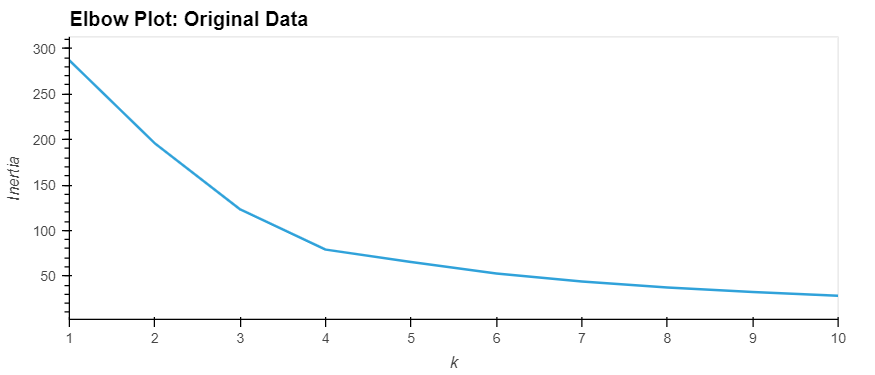
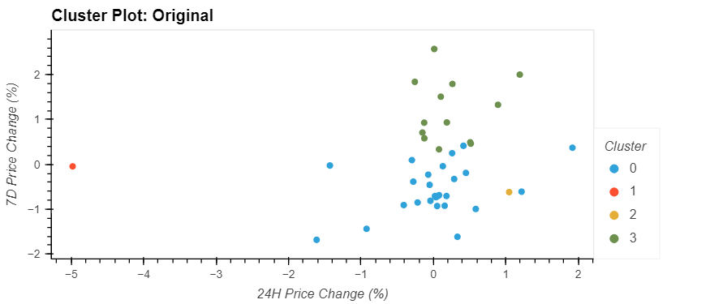

# Fintech KMeans Cryptocurrency clustering

Jupyter Notebook that uses Scikit-learn Machine Learning, Pandas, and Holoviz to analyze and visualize cryptocurrency clustering using unsupervised learning.

## Technologies

The application uses the following technologies:

- Python 3.7
- [pandas](https://pandas.pydata.org/pandas-docs/stable/index.html)
- [Jupyter Lab](https://jupyter.org/)
- [PyViz (Holoviz)](https://hvplot.holoviz.org/)
- [Scikit-learn](https://scikit-learn.org/stable/index.html)

## Installation Guide

```python

pip install numpy
pip install pandas
pip install matplotlib
conda install -c pyviz hvplot geoviews
pip install -U scikit-learn

```

### Jupyter

The application is based on a Jupyter Notebook. The minimum required is a Jupyter Notebook but Jupyter Lab can be installed as well.  Please review the [Jupyter installation instructions](https://jupyter.org/install)

## Usage

### Startup

- Launch Jupyter
- Load **crypto_investments.ipynb** and select **Run => Restart Kernal and Run all Cells** from the menu

### Inputs

CSV file containing cryptocurrency price change data in different periods.  Header:

1. coin_id
2. price_change_percentage_24h
3. price_change_percentage_7d
4. price_change_percentage_14d
5. price_change_percentage_30d
6. price_change_percentage_60d
7. price_change_percentage_200d
8. price_change_percentage_1y

### Analysis Output Examples

The data was placed in a Pandas DataFrame and KMeans analysis was run against the original data to determine clustering. Next, Principal Component Analysis (PCA) was used to reduce the features to determine if the clustering could be further refined.





## Brief Analysis Review

In this study Principal Component Analysis did not yield differing clustering results. In both cases the optimum number of clusters was 4. 

## Contributors

- Jacob Rougeau

## License

MIT
